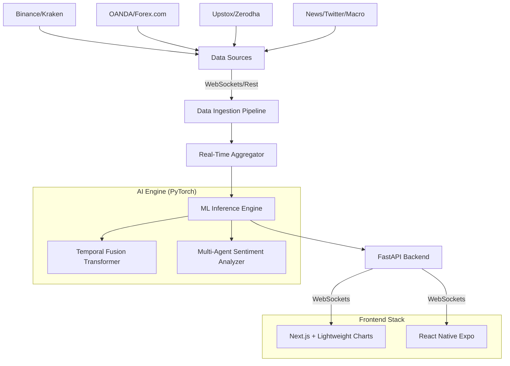

# OmniTrade AI: High-Frequency Market Analysis System

## 1. System Architecture

## 2. Directory Structure

- `backend/`: FastAPI application, real-time inference logic, and WebSocket server.
- `ml_engine/`: PyTorch model definitions (TFT), training scripts, and weight management.
- `data_pipeline/`: Multi-asset scrapers, news aggregators, and feature engineering scripts.
- `frontend_web/`: Next.js web application with TradingView charts and real-time dashboard.
- `frontend_mobile/`: Expo/React Native app for iOS and Android.

## 3. Implementation Roadmap

### Phase 1: Foundation (Current)
- Setup directory structure.
- Implement FastAPI WebSocket skeleton.
- Create multi-asset data scraper boilerplate.
- Design the Next.js Dashboard UI with terminal aesthetics.

### Phase 2: ML & Data
- Define the TFT (Temporal Fusion Transformer) architecture in PyTorch.
- Implement data normalization and sliding window buffers.
- Integrate CrewAI for macroeconomic sentiment analysis.

### Phase 3: Integration & Optimization
- Connect live data feeds to the inference loop.
- Optimize for low-latency (sub-second) signal delivery.
- Build the React Native mobile interface.
